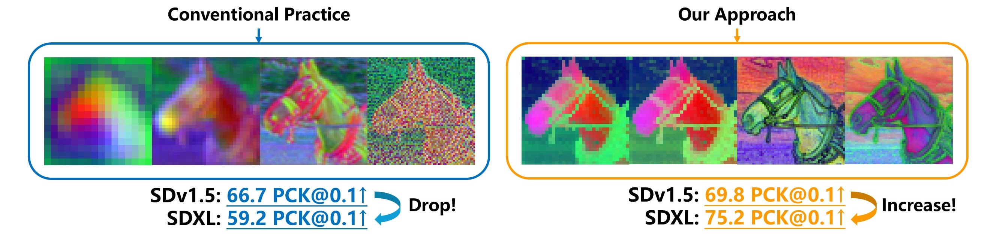
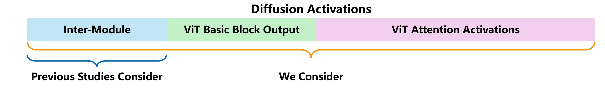
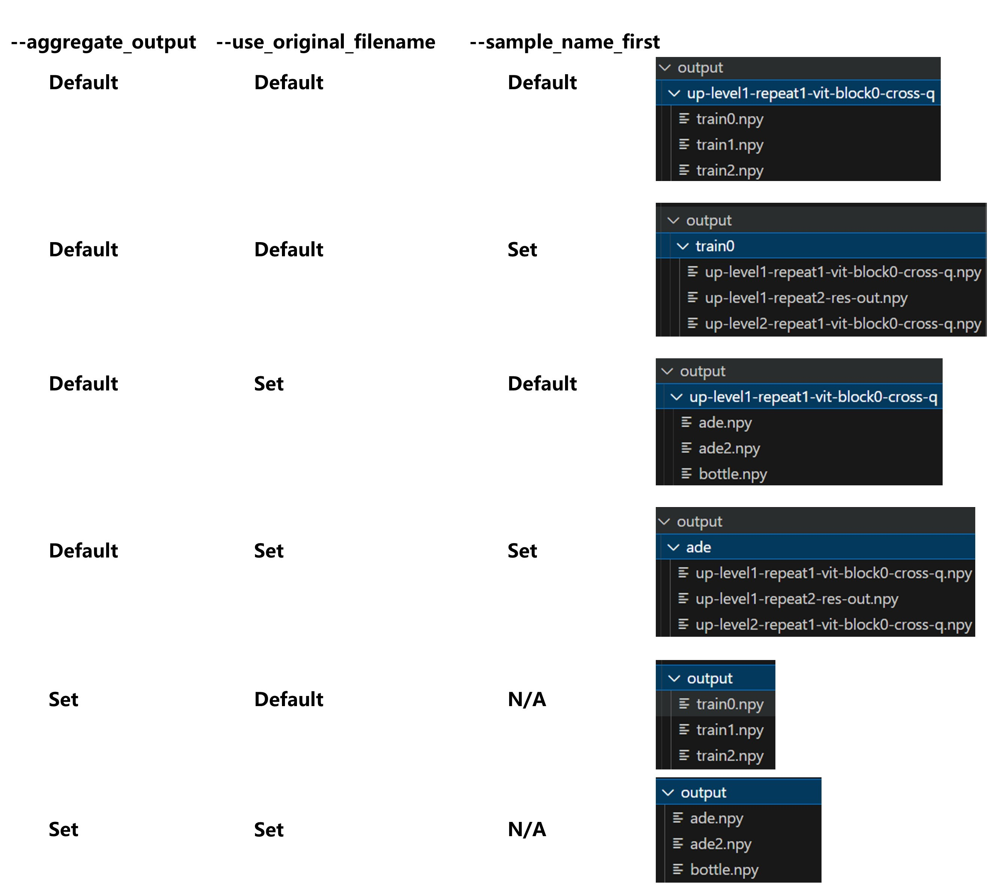

# Generic Diffusion Feature
We want this to be **both** the official implementation of NeurIPS'24 Spotlight paper [Not All Diffusion Model Activations Have Been Evaluated as Discriminative Features](https://arxiv.org/abs/2410.03558) **and** a generic codebase for all who are interested in diffusion feature.

## Why you might be interested in this work
Diffusion feature is a quite popular way to utilize **generative** diffusion models for **discrimination**.
It's very simple: just extract some internal activations from a diffusion model, and then use these 2D features to replace image inputs of any discriminative model.  

There have been quite many diffusion feature studies. But we notice that almost all of them experiment with Stable Diffusion v1.4, v1.5, v2.0, and v2.1 models. These models all share the same architecture and are really outdated today.
So we wonder if a newer model with a different architecture, such as Stable Diffusion XL, can bring better performance?
The result is not good. **Although the model becomes stronger, the performance even drops a lot.**  
  
  

Starting with this key observation, we discover that previous studies have only considered a limited part of all activations as feature candidates. This is why the conventional practice of feature extraction struggles to extend to new models.
We further study the properties of these neglected activations and eventually arrive at a more thorough understanding of diffusion feature extraction.
**Now, we are finally able to make the stronger Stable Diffusion XL model actually outperform its opponent.**  

For more details, please check out our paper!  

## Why you should choose this codebase as your baseline
- **Direct integration into your project!** This codebase can be installed as a package and directly called in your project. We also provide a standalone script to extract and store features if you prefer otherwise.
- **Precise control over feature extraction!** With this codebase, you have full control over every layer of interset in diffusion models. You can precisely control where and how features are extracted.
- **Embrace Diffusers!** This codebase uses 🤗 Diffusers lib, which is more compatible, extensible, and easier to understand and edit, than the StabilityAI official repo of Stable Diffusion. You can easily add new models to this codebase, thanks to 🤗 Diffusers.
- **Migration to mmseg 2.x!** Previous diffusion segmentor baselines have been vastly using mmseg 1.x for segmentation tasks, which is incompatible with many other appealing packages that require pytorch 2.x. We have managed to migrate to mmseg 2.x.

## Repo structure
If you want to use this codebase in your project, you might want to pay attention to `extract_feature.py` and `feature/`. These are where the feature extractor is implemented.  

For reproducing the results in our paper, check out `correspondence/`, `segmentation/`, and `scarce_segmentation`.  

We also provide a handy visualization tool in `feature_visualization.py`.  

## Installation
**Step 1**: install dependencies:
(The following instructions are based on CUDA 11.8. You can change to your own environment.)
```bash
# create a new environment
conda create -n generic-diffusion-feature python=3.9
conda activate generic-diffusion-feature

# install cuda, skip this if you have it installed already
conda install nvidia/label/cuda-11.8.0::cuda
conda install nvidia/label/cuda-11.8.0::cuda-cudart
conda install nvidia/label/cuda-11.8.0::libcusparse
conda install nvidia/label/cuda-11.8.0::libcublas

# install pytorch
pip3 install torch==2.2.0 torchvision==0.17.0 torchaudio==2.2.0 --index-url https://download.pytorch.org/whl/cu118

# install other packages
pip3 install diffusers["torch"]==0.29.2 transformers controlnet_aux
pip3 install tqdm tensorboard flake8 ipykernel pytest seaborn sentencepiece beautifulsoup4
pip3 install xformers==0.0.24+cu118 --index-url https://download.pytorch.org/whl/cu118  # reduce memory usage
pip3 install accelerate ipdb pytest-env wandb
pip3 install invisible-watermark>=0.2.0  # remove >=0.2.0 if pip can't find anything
pip3 install blobfile
pip3 install opencv-python  # maybe already installed in previous steps
pip3 install omegaconf  # this will not be needed once diffusers fully support loading kohya lora weights
pip3 install scikit-learn==1.0.2
```

To run segmentation tasks, you also need to install mmseg. We recommend first trying the official guide at https://github.com/open-mmlab/mmsegmentation/blob/main/docs/en/get_started.md#installation. If you have trouble connecting to mim server, try `pip3 install mmcv==2.1.0 mmsegmentation==1.2.2 ftfy` instead. However, this requires compiling mmseg from sources, which is slow and potential to encounter issues.  

**Step 2**: overwrite some 🤗 Diffusers files with the files in `feature/diffusers`. You can find the installed lib files at `anaconda3/envs/generic-diffusion-feature/lib/python3.9/site-packages/diffusers`.  

**Step 3**: install this codebase as a package.
```bash
cd feature & pip3 install -e .
```

**Step 4**: download diffusion models. Normally, new models will be automatically downloaded so you don't need to do anything. If you have trouble connecting to 🤗 Diffusers server, there's another solution for you. Go to `feature/components/models.py`. Here you can see the ids of models, such as `stable-diffusion-v1-5/stable-diffusion-v1-5`. Google this id and you can find the correponding 🤗 Diffusers repo. Manually download model weights, and then modify the ids in `feature/components/models.py` to point to your local files.

## Usage
### Integrating into your codes
Below is a simple example:
```python
# import the codebase as a package
import diffusion_feature

from PIL import Image

# initialize a feature extractor
df = diffusion_feature.FeatureExtractor(
    layer={
        'up-level1-repeat1-vit-block0-cross-q': True,  # a feature within ViT
        'up-level2-repeat1-vit-block0-cross-map': True,  # an attention score map
        'up-level2-upsampler-out': True,  # a feature between two blocks, aka a conventional feature
    },
    version='1-5',
    img_size=512,
    device='cuda',
)

# load your images
img = Image.open('some_image.png')

# prepare a prompt
# this prompt should be describing the image content
prompt = df.encode_prompt('a photo of a cat')

# run the extraction
features = df.extract(prompt, batch_size=1, image=[img])

# check the results
for k, v in features.items():
    print(k, v.shape)
```

When initializing the feature extractor, you can pass the following arguments:
- Common arguments:
    - `layer`: Where features should be extracted. We provide pre-defined layer configs in `feature/configs`. `config_15_practical.json` and `config_xl_practical.json` are the two recommended feature choices. **All legal layer ids can be printed using the standalone script's `show_all_layers` flag.**
    - `version`: What diffusion model should be used. Now we support Stable Diffusion v1.5 (1-5), Stable Diffusion v2.1 (2-1), Stable Diffusion XL (xl), Playground v2 (pgv2), and PixArt-Sigma (pixart-sigma).
    - `device`: On what device should the model be loaded.
    - `dtype`: Data type for diffusion models. We recommend float16 for most use cases.
    - `img_size`: All images will be resized to the given size before feeding into diffusion models. Usually each diffusion model is specially trained to work best on a given resolution.
- Advanced arguments:
    - `offline_lora` and `offline_lora_filename` for loading LoRA weights. The first choice works when the LoRA weight has already been integrated into a whole model weight folder. The second choice will insert the LoRA weight into the model for you.
    - `feature_resize`: Setting this argument to >1 will compress the width and height of extracted features, for low memory/disk users.
    - `control`: Add ControlNet to the diffusion model. Check `feature/components/controlnet.py` for available options.
    - `attention`: Add aggregated attention score maps to feature extraction. We now support directly indicate score maps using `xxx-cross/self-map` in the layer param. This option is only kept here to be compatible with some previous codes.
    - `train_unet`: Set this as True to keep all features not detached from the computation graph, so that you can train the diffusion model with some downstream supervision. This requires very large VRAM.

Below are the arguments of `extract()`:
- `prompts`: Pass the output of `encode_prompt()` here.
- `batch_size`: Normally this should be set as the number of images.
- `image`
- `image_type`: We support PIL Images and pytorch Tensors.
- `t`: At which timestep should features be extracted.
- `use_control`: Set True if you are using ControlNet.
- `use_ddim_inversion`: DDIM inversion means adding noises to the input image not by random sampling, but according to the output of a U-Net run. This improves performance a bit but is slow. **Experimental**. It's not used for the experiments in our paper.
- `denoising_from`: *This is a deprecated function for compatibility*.

### Standalone script
We provide a standalone script, `extract_feature.py`, if you want to store features on disks and use them later.
To use it, first create a file `prompt.txt` and write a prompt that can describe the images.  

Simple example:
```bash
python3 extract_feature.py \
    --layer ./feature/configs/config_15_practical.json \
    --version 1-5 --img_size 512 \
    --input_dir "/data/diffusion-feature/datasets/visualization/*" \
    --batch_size 2 --t 50 \
    --use_original_filename --sample_name_first
```

Most arguments have the same meaning as the integration usage. But this script has some additional IO arguments, as shown below.  

Input:
- `input_dir` should point to the images. We support glob style paths, such as `some/path/*.png`, so that jpg files will be ignored.
- `nested_input_dir` is for an image folder with many levels, such as how CityScapes dataset is organized. (Recommended using along with `aggregate_output`.)
- `prompt_file` points to the file that contains your prompt.

Output: `output_dir` indicates the output folder. `aggregate_output`, `use_original_filename`, and `sample_name_first` are options to toggle how outputs are organized. Their valid combinations are shown below. When `use_original_filename` is not set, you can use `split` to indicate how files should be named.
  

**Don't know what layers a diffusion model contains?** Use `--show_all_layers` to print all layers and corresponding feature shapes. A corresponding config file will also be generated at the root directory. Note that turning on this option will cause the script not to store any feature.  

### Background Extraction
Now we support a new feature: you can extract features in the background while doing other staff like generating an image. This allows you to do feature extraction in the t2i generation pipeline.  

See `generate_with_extraction.py` for an example.  

### A useful feature visualization tool
Do you want to make the same type of feature visualization as shown in our paper? Try `feature_visualization.py`! It's a simple script that perform PCA analysis to visualize any 2D features.  

## Citation
```text
@inproceedings{meng2024diffusionmodelactivationsevaluated,
  author       = {Benyuan Meng and
                  Qianqian Xu and
                  Zitai Wang and
                  Xiaochun Cao and
                  Qingming Huang},
  title        = {Not All Diffusion Model Activations Have Been Evaluated as Discriminative
                  Features},
  booktitle    = {Annual Conference on Neural Information Processing Systems},
  year         = {2024},
  pages        = {55141-55177},
}
```
